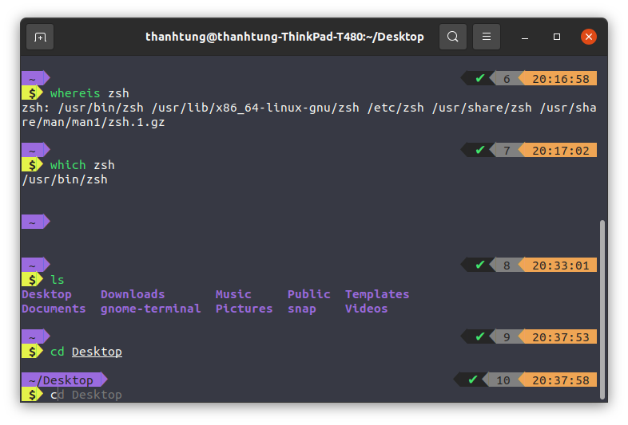

# Set up environment Ubuntu 20

## Update all app

- Update is used resynchronize the package index file from their sources on Ubuntu Linux via the Internet.

```shell
sudo apt-get update
```

- Upgrade is used to install the newest versions of all packages currently installed on the Ubuntu version.

```shell
sudo apt upgrade
```

## Install gnome shell

```shell
sudo apt install gnome-shell-extensions 
```

*Note: After install should be restarted.*

## Custom Dock


- Install dconf-editor

```shell
sudo apt install dconf-editor
```

- List commands will yield the result shown in the screenshot:

```shell
gsettings set org.gnome.shell.extensions.dash-to-dock dock-position BOTTOM
gsettings set org.gnome.shell.extensions.dash-to-dock transparency-mode FIXED
gsettings set org.gnome.shell.extensions.dash-to-dock dash-max-icon-size 64
gsettings set org.gnome.shell.extensions.dash-to-dock unity-backlit-items true
gsettings set org.gnome.shell.extensions.dash-to-dock extend-height false
gsettings set org.gnome.shell.extensions.dash-to-dock dash-max-icon-size 32
```

## Custom terminal



## ZSH vs Oh my Zsh

Install **ZSH**:

```shell
sudo apt-get install zsh
```

find out the path of the **ZSH** shell:

```shell
which zsh
```

set **ZSH** as the default login shell for the user you’re logged in:

```shell
sudo usermod -s /usr/bin/zsh $(whoami)
```

Install [Powerline Fonts](https://github.com/powerline/fonts) :

```shell
sudo apt-get install fonts-powerline
```

[Oh my Zsh](https://github.com/ohmyzsh/ohmyzsh) is a Zsh configuration framework. To install it :

```shell
sh -c "$(curl -fsSL https://raw.githubusercontent.com/ohmyzsh/ohmyzsh/master/tools/install.sh)"
```

### Theme

Powerlevel9k Zsh theme

```shell
git clone https://github.com/bhilburn/powerlevel9k.git ~/.oh-my-zsh/custom/themes/powerlevel9k
```

Then edit `~/.zshrc` configuration file and set:

```shell
ZSH_THEME="powerlevel9k/powerlevel9k"
```

[Dracula theme](https://draculatheme.com/gnome-terminal)

### Other tweaking

- Shorter prompt: `~/.zshrc` file

  ```shell
  POWERLEVEL9K_LEFT_PROMPT_ELEMENTS=(dir rbenv vcs virtualenv)
  POWERLEVEL9K_RIGHT_PROMPT_ELEMENTS=(status root_indicator background_jobs history time)
  ```

- Change color of warning git status

  ```sh
  POWERLEVEL9K_VCS_MODIFIED_BACKGROUND=’red’
  ```

- New line after each prompt

  ```sh
  POWERLEVEL9K_PROMPT_ADD_NEWLINE=true
  ```

- Use Cursor in new line

  ```shell
  POWERLEVEL9K_PROMPT_ON_NEWLINE=true
  ```

- Make it beautiful with the $ character

  ```shell
  # Add a space in the first prompt
  POWERLEVEL9K_MULTILINE_FIRST_PROMPT_PREFIX="%f"
  # Visual customisation of the second prompt line
  local user_symbol="$"
  if [[ $(print -P "%#") =~ "#" ]]; then
      user_symbol = "#"
  fi
  POWERLEVEL9K_MULTILINE_LAST_PROMPT_PREFIX="%{%B%F{black}%K{yellow}%} $user_symbol%{%b%f%k%F{yellow}%} %"
  ```

- Vertical cursor

```
Terminal Menu
  -> Preferences
    -> Profile
      -> Cursor
        -> Cursor Shape
          -> I-beam
```

- [Zim](https://github.com/zimfw/zimfw): is a Zsh configuration framework with [blazing speed](https://github.com/zimfw/zimfw/wiki/Speed) and modular extensions.

```sh
curl -fsSL https://raw.githubusercontent.com/zimfw/install/master/install.zsh | zsh
```